# Exploring Baby Names
Auren Ferguson  
27 December 2016  


# Introduction
This document explores US baby naming trends from 1910-2015. The data can be downloaded from <http://www.ssa.gov/oact/babynames/state/namesbystate.zip>

# Exploring Baby Names
## Loading librarys


```r
library(data.table)
library(dplyr)
library(ggplot2)
library(scales)
```

## Reading Data In and Aggregating

The data comes in the format of names by year for each state. In order to get a national figure we have to read in the data from each and bind them together.


```r
# filelist = list.files(path = "/Users/aurenferguson/Downloads/namesbystate", pattern = ".TXT")
# 
# datalist = lapply(filelist, function(x)read.csv(x, header=F)) 
# 
# #assuming the same header/columns for all files
# baby_names = bind_rows(datalist)
# 
# # converting to tbl
# baby_names <- as.tbl(baby_names)
# 
# # renaming columns
# baby_names <- dplyr::rename(.data = baby_names, state = V1, sex = V2, year = V3, name = V4, amount = V5)
# 
# fwrite(baby_names, file = "baby_names_all_states.csv")
```

The code is commented out as I have already done this and exported a national csv file which is read in.


```r
baby_names <- as.tbl(fread(input = "baby_names_all_states.csv"))
```

```
## 
Read 93.2% of 5743017 rows
Read 5743017 rows and 5 (of 5) columns from 0.105 GB file in 00:00:03
```

```r
head(baby_names)
```

```
## # A tibble: 6 × 5
##   state   sex  year     name amount
##   <chr> <chr> <int>    <chr>  <int>
## 1    AK     F  1910     Mary     14
## 2    AK     F  1910    Annie     12
## 3    AK     F  1910     Anna     10
## 4    AK     F  1910 Margaret      8
## 5    AK     F  1910    Helen      7
## 6    AK     F  1910    Elsie      6
```

## Most Popular Baby Names of All Time
Its interesting to see which are the most popular names of all time (1910-2015 anyway)


```r
popular_names_all_time <- function(df){
  df <- df %>% group_by(name) %>% summarise(total = sum(amount)) %>%
    arrange(desc(total)) %>% head(10)
  ggplot(data = df, aes(x = reorder(name, -total), y = total, fill = name)) + 
    geom_bar(stat = "identity") +
    scale_y_continuous(labels = comma) +
    guides(fill = FALSE) +
    ylab("Count") +
    xlab("Name") +
    labs(title = "Most poplular names (1910-2015)")
}

popular_names_all_time(baby_names)
```

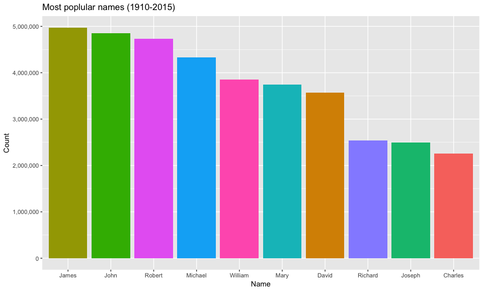<!-- -->

## Gender Ambigious Names
Will try and find the most gender ambiguous names of the whole data set and then on specific years. However, there are many ways to tackle this problem that will get different results. I will use two methods: finding common gender ambiguous names where there are similar amounts of male and females with same name and a method that gets the exact same amount of males and females for a specific year. This method however generally picks out unusual names with low counts.

### Common Ambigious Names


```r
Gender_ambig_common_name <- function(df, yr = NULL){
  if(missing(yr)){
    
    # only taking common names i.e, total > 100  
    df <- df %>% group_by(name, sex) %>%
      summarise(total = sum(amount)) %>% arrange(desc(total)) %>% filter(total >= 100)
    
    # Keeps all duplicates, i.e. male and female of same name
    df <- df[duplicated(df$name) | duplicated(df$name, fromLast=TRUE), ]
    
    # Another dataframe that goes to name level,
    #therefore the difference between total is due to amount of male and female
    df_a <- df %>% group_by(name) %>% summarise(total_amt = sum(total)) %>%
      arrange(desc(total_amt)) %>% rename(total_male_female = total_amt)
    
    # Joins the 2 dataframes, allowing a ratio of male female to be calculated
    df <- left_join(df, df_a, by = "name")
    
    # Male/Female calculation ratio of total for each name
    df$ratio <- df$total / df$total_male_female
    
    # selects ratio of 0.5 and removes duplicates for clarity.
    # 0.5 corresponds to a name being exactly half male and half female
    df <- df %>% filter(ratio >= 0.4 & ratio <= 0.6) %>% distinct(name,.keep_all = T) %>%
      arrange(desc(total_male_female)) %>% head(10)
    
    # Visualising results
    ggplot(data = df, aes(x = reorder(name, -total_male_female), y = total_male_female, fill = name)) + 
      geom_bar(stat = "identity") +
      scale_y_continuous(labels = comma) +
      guides(fill = FALSE) +
      ylab("Count") +
      xlab("Name") +
      ggtitle(label = paste("Most common gender ambigious names 1910-2015"))
    
  }else{
    # only taking common names i.e, total > 100  
    df <- df %>% filter(year == yr) %>% group_by(name, sex) %>%
      summarise(total = sum(amount)) %>% arrange(desc(total)) %>% filter(total >= 100)
    
    # Keeps all duplicates, i.e. male and female of same name
    df <- df[duplicated(df$name) | duplicated(df$name, fromLast=TRUE), ]
    
    # Another dataframe that goes to name level,
    #therefore the difference between total is due to amount of male and female
    df_a <- df %>% group_by(name) %>% summarise(total_amt = sum(total)) %>%
      arrange(desc(total_amt)) %>% rename(total_male_female = total_amt)
    
    # Joins the 2 dataframes, allowing a ratio of male female to be calculated
    df <- left_join(df, df_a, by = "name")
    
    # Male/Female calculation ratio of total for each name
    df$ratio <- df$total / df$total_male_female
    
    # selects ratio of 0.5 and removes duplicates for clarity.
    # 0.5 corresponds to a name being exactly half male and half female
    df <- df %>% filter(ratio >= 0.4 & ratio <= 0.6) %>% distinct(name,.keep_all = T) %>%
      arrange(desc(total_male_female)) %>% head(10)
    
    # Visualising results
    ggplot(data = df, aes(x = reorder(name, -total_male_female), y = total_male_female, fill = name)) + 
      geom_bar(stat = "identity") +
      scale_y_continuous(labels = comma) +
      guides(fill = FALSE) +
      ylab("Count") +
      xlab("Name") +
      ggtitle(label = paste("Most common gender ambigious names", yr))
  }
}

# Most ambigious names of all 
Gender_ambig_common_name(df = baby_names)
```

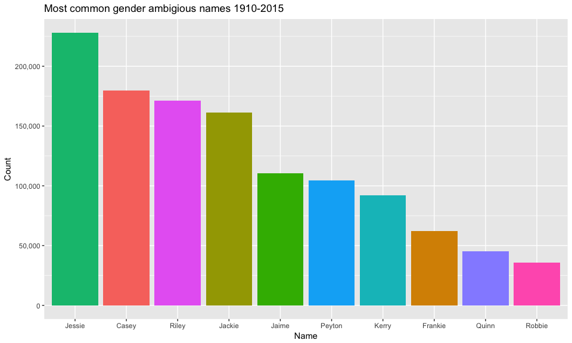<!-- -->

```r
# Most ambigious names for specific years
Gender_ambig_common_name(df = baby_names, yr = 2013)
```

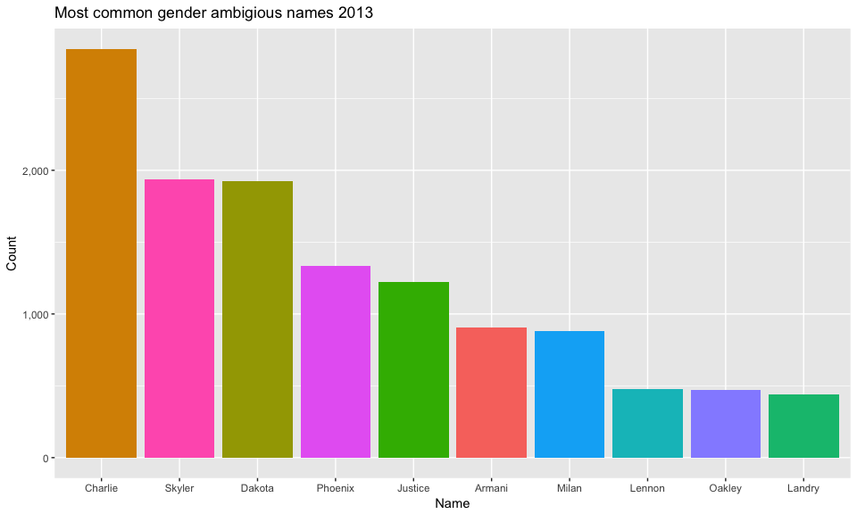<!-- -->

```r
Gender_ambig_common_name(df = baby_names, yr = 1945)
```

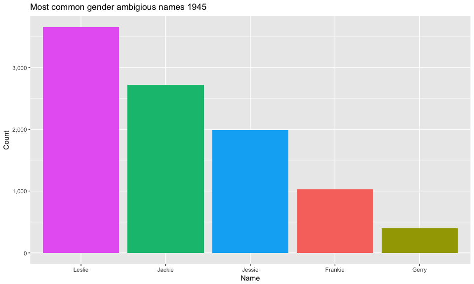<!-- -->

We can see that Jessie is the most common gender ambiguous name for all years, while in 2013 names such as Skyler and Armani are popular. The names from 1945 are more traditional compared to 2013. 

### Names that have exactly the same amount of male and females by year
This method finds the names that have the exact same amount of males and females. As mentioned earlier, this method tends to pick out unusual names with low counts. However, they are the **most ambigious names** with:

$$\sum Men = \sum Female$$

```r
Gender_ambig_name <- function(df, yr){
  
  # Filters for the year, aggregates to name, sex level and sums amount
  df <- df %>% filter(year == yr) %>% group_by(name, sex) %>%
    summarise(total = sum(amount)) %>% arrange(desc(total))
  
  # Keeps all duplicates, i.e. male and female of same name
  df <- df[duplicated(df$name) | duplicated(df$name, fromLast=TRUE), ]
  
  # Another dataframe that goes to name level,
  #therefore the difference between total is due to amount of male and female
  df_a <- df %>% group_by(name) %>% summarise(total_amt = sum(total)) %>%
    arrange(desc(total_amt)) %>% rename(total_male_female = total_amt)
  
  # Joins the 2 dataframes, allowing a ratio of male female to be calculated
  df <- left_join(df, df_a, by = "name")
  
  # Male/Female calculation ratio of total for each name
  df$ratio <- df$total / df$total_male_female
  
  # selects ratio of 0.5 and removes duplicates for clarity.
  # 0.5 corresponds to a name being exactly half male and half female
  df <- df %>% filter(ratio == 0.5) %>% distinct(name,.keep_all = T)
  
  # Visualising results
  ggplot(data = df, aes(x = reorder(name, -total_male_female), y = total_male_female, fill = name)) + 
    geom_bar(stat = "identity") +
    scale_y_continuous(labels = comma) +
    guides(fill = FALSE) +
    ylab("Count") +
    xlab("Name") +
    ggtitle(label = paste("Most uncommon ambigious names", yr))

}

Gender_ambig_name(baby_names, yr = 2013)
```

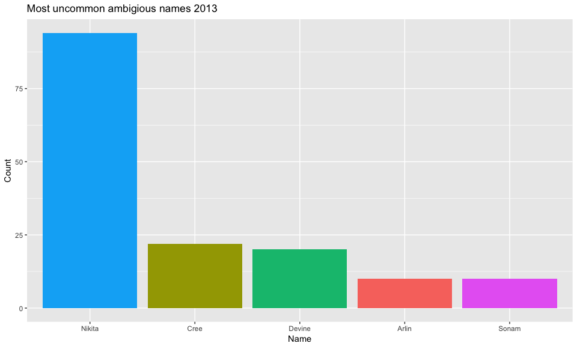<!-- -->

```r
Gender_ambig_name(baby_names, yr = 1946)
```

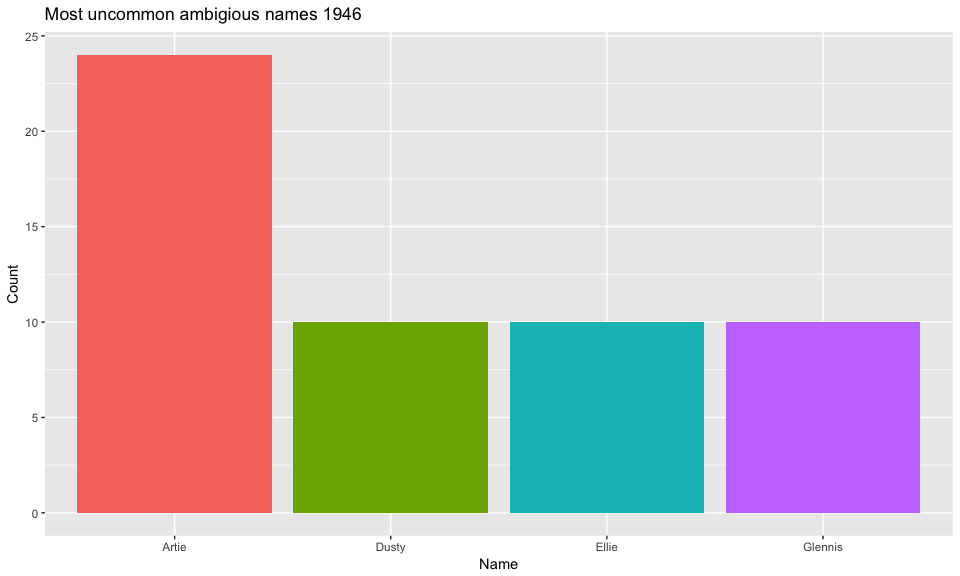<!-- -->

```r
Gender_ambig_name(baby_names, yr = 2014) 
```

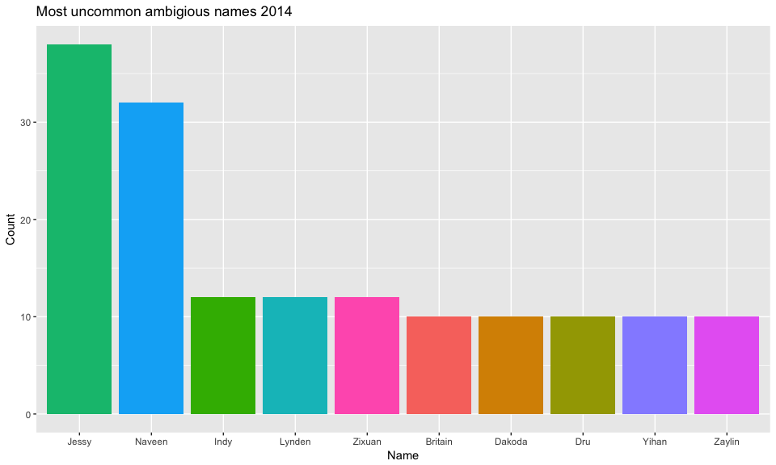<!-- -->


## Names that have Increased and Decreased in Popularity with Time
One obvious thing to think about would be to examine names whose popularity have changed over time. This section picks out the biggest increase and decrease in popularity of names over a certain time period.


```r
change_popularity_time <- function(df, yr_1 = 1980, yr_2 = 2015){
  
  if(yr_1 < yr_2){
    a <- df %>% filter(year == yr_1) %>% group_by(name) %>%
      summarise(total = sum(amount)) 
    
    a <- a %>% mutate(pct_of_total_a = (total / sum(total)) * 100) %>%
      # select(name, pct_of_total_a) %>% 
      arrange(desc(pct_of_total_a))
    
    b <- df %>% filter(year == yr_2) %>% group_by(name) %>%
      summarise(total = sum(amount)) 
    
    b <- b %>% mutate(pct_of_total_b = (total / sum(total)) * 100) %>%
      #select(name, pct_of_total_b) %>% 
      arrange(desc(pct_of_total_b))
    
    c <- inner_join(a, b, by = "name")
    
    c <- filter(c, total.x >= 100 & total.y >= 100)
    
    c <- c %>% mutate(pct_change = ifelse(total.x < total.y, (total.y - total.x) / total.x,
                                          (total.y - total.x) / total.y)) %>%
      arrange(desc(pct_change))
    #%>% head(10)
    
    d <- c[1:10,]
    
    e <- c[(nrow(c) - 9): nrow(c),]
    
    f <- bind_rows(d,e)
    
    ggplot(data = f, aes(x = reorder(name, -pct_change), y = pct_change, fill = name)) + 
      geom_bar(stat = "identity") +
      scale_y_continuous(labels = comma) +
      guides(fill = FALSE) +
      ylab("Changed by (times)") +
      xlab("Name") +
      ggtitle(label = paste("Names with largest increase and decrease from", yr_1, "-", yr_2))
  }else{
    print("yr_1 should be before yr_2, please swap their values")
  }
}

change_popularity_time(baby_names)
```

<!-- -->

```r
change_popularity_time(baby_names, yr_1 = 1910, yr_2 = 2015)
```

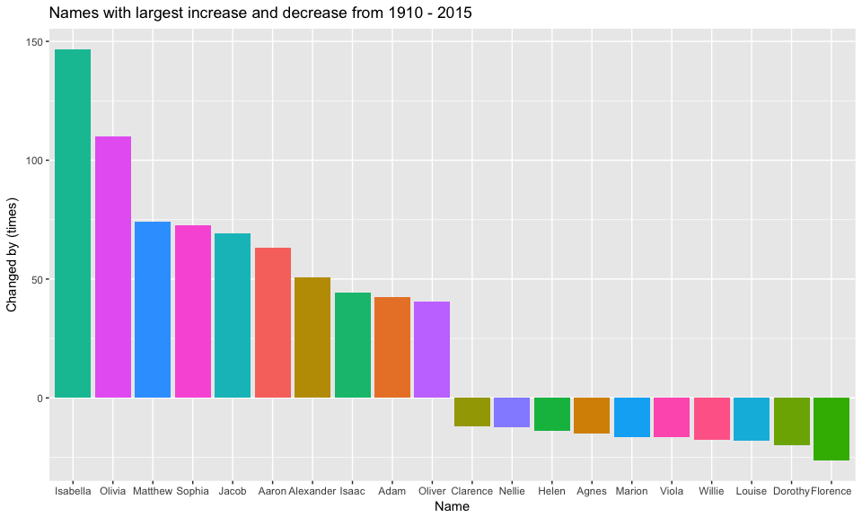<!-- -->

Over the last 25 years, Sebastian has seen the biggest jump in popularity with an increase of $\approx$ 75 times while Heather has decreased in popularity by a similar amount. While over the the whole time span, Isabella has increased by $\approx$ 150 times and has decreased by $\approx$ 25 times. The increased magnitude for the increase and lower decrease could be due to increase number being born over time. This could be perhaps improved by normalising for birth rate.

## Has Name Diversity Increased Over Time
One interesting idea was to examine if people are naming their children with more unique names over time.

### Absolute Change


```r
name_diversity <- function(df){
  df <- df %>% group_by(year, sex) %>% summarise(total_unique = length(unique(name)))
  ggplot(data = df, aes(x = year, y = total_unique, color = sex)) + 
    geom_point() + 
    labs(y = "Unique names")
}
name_diversity(df = baby_names)
```

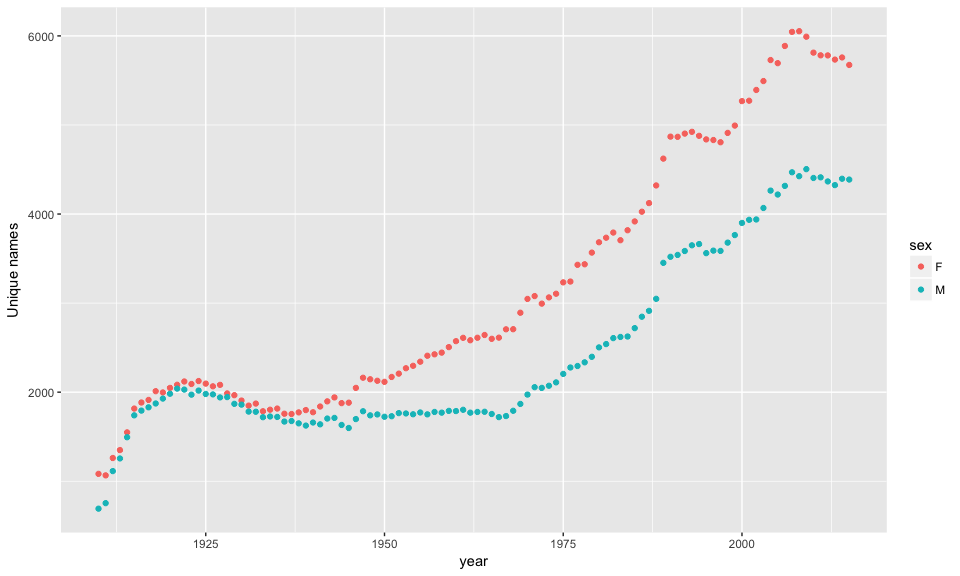<!-- -->

We can see that the number of unique names does increase over time for both males and females. However, as shown below, the number of births increases over time too, so this just could be a product of an increase in births. To check this, the next section normalises the unique names by total births that year.

### Relative Change


```r
name_diversity_normalised <- function(df){
  
  df <- df %>% group_by(year, sex) %>% 
    summarise(total = sum(amount), total_unique = length(unique(name))) %>%
    mutate(unique_percentage = (total_unique / total) * 100)
  
  ggplot(data = df, aes(x = year, y = unique_percentage, color = sex)) + 
    geom_point() + 
    labs(y = "Percentage of unique names")
}

name_diversity_normalised(baby_names)
```

<!-- -->

This plot shows a very different trend with a 'U' shaped curve vs time. Name uniqueness is very high for both males and females in the 1910's but decreases until the mid 60's. The plot minima could be due to a large spike in the birth rate during those years (baby boomers), graph shown below and as a result its harder to name your child a unique name. Uniqueness increases again post 1975 while birthrate remains roughly stagnant. This means that uniqueness has increased over last 25 years or so, with females more than likely to have a unique name than males.

**__One point to note__**: The term uniqueness isn't very accurate as a name must appear 5 times in a state in order to be part of this data set. So in reality, uniqueness is if a name only appears in one state that year. This is a limitation of the data and there isn't much that can be done about it.

## Birthrate as a Function of Time


```r
birth_numbers_per_year <- function(df){
  df  <- df %>% group_by(year, sex) %>% summarise(total_births = sum(amount))
  ggplot(df, aes(x = year, y = total_births, color = sex)) + geom_point() + geom_line() + labs(y = "Number of births")
}

birth_numbers_per_year(baby_names)
```

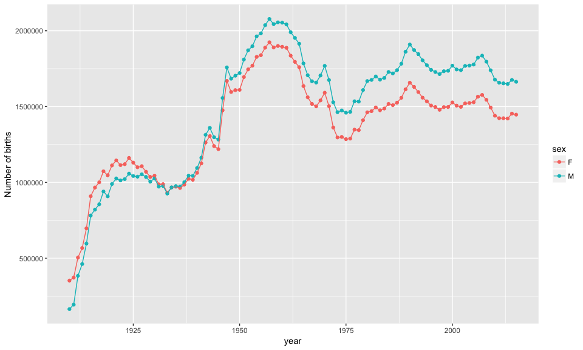<!-- -->

We can see that the birthrate increases rapidly from 1910-1967 but then drops and becomes reasonably invariant. There is a large peak in the 60's due to the baby boomer generation. Assuming the death rate decreased with time too, this shows a large population increase over time. This can be verified by (source: <https://en.wikipedia.org/wiki/Demographic_history_of_the_United_States#Historical_population>)

Year | Population
---- | ----------
1910 | 92,228,496
1930 | 123,202,624
1950 | 151,325,798
1970 | 203,211,926
1990 | 248,709,873
2010 | 308,745,538


## Are Babies Named After Famous People
One might think that babies are named after famous names of the time.


```r
famous_name_check <- function(df, name_lookup = "Jackie"){
  df <- df %>% group_by(name, year) %>% summarise(total = sum(amount)) %>% filter(name == name_lookup)
  ggplot(data = df, aes(x = year, y = total, color = name_lookup)) + 
    geom_point() + geom_line() + labs(y = "Number of names")
}
```

### Jackie (Kennedy)

```r
famous_name_check(baby_names, name_lookup = "Jackie")
```

<!-- -->
We see a peak of Jackie's around 1960, this corresponds with the presidency of JFK.

### Marilyn (Monroe)

```r
famous_name_check(baby_names, name_lookup = "Marilyn")
```

<!-- -->
The name Marilyn became popular around 1940 to the mid 1960's. It's hard to say if Marilyn Monroe had a strong effect on the name, it's certainly not as obvious as in the case of Jackie

### Channing (Tatum)

```r
famous_name_check(baby_names, name_lookup = "Channing")
```

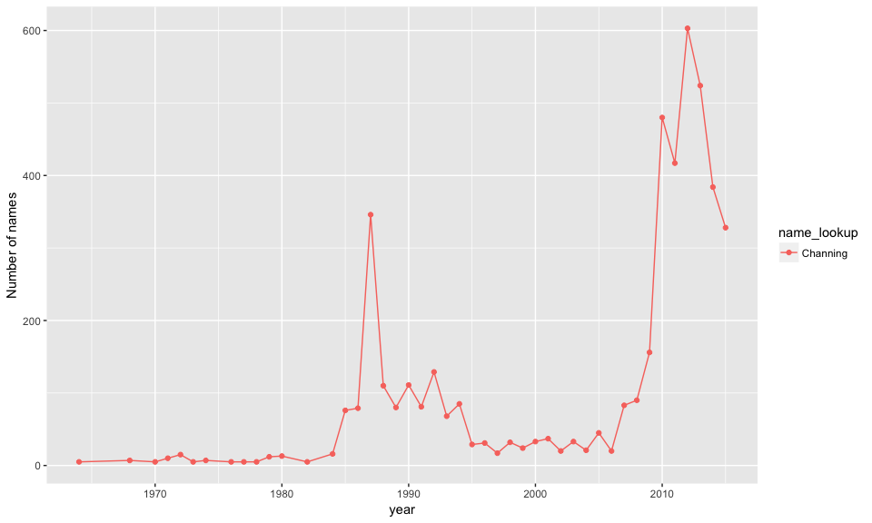<!-- -->
We focus on a modern celebrity with a slightly unusual name in the form of Channing Tatum. There is a clear spike in the amount of Channings around 2010, this corresponds to when he became famous. There is another spike around the mid 80's but I amn't aware of any famous Channings from this time.


